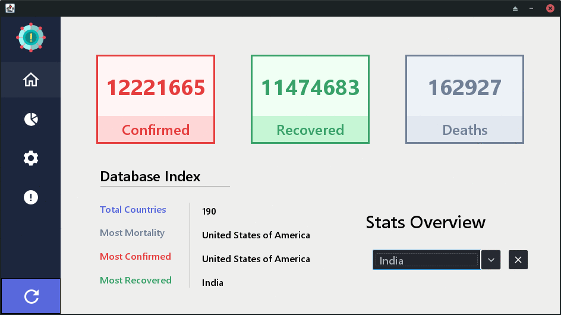

<h1 align="center">Corona Dashboard</h1>

<strong>Simple dashboard application to track covid data based on countries</strong>
 project is made as part of college project

 

<h2>About</h2>
This project provides a way to track, filter, and keep database records of reported cases, deaths, and recovery caused due to SARS-COV-2 aka Corona virus.

<h2>Requirements</h2>

1. JDK 8
2. Maven
3. MySql
4. JDBC
4. Netbeans ( Optional )
5. Python ( Optional )

<h2>Installation</h2>

1. clone the project 
&emsp;<code>git clone https://github.com/alenpaul2001/CoronaDashboard</code>
2. create new mysql user with username and password as corona 
&emsp;<code>CREATE USER 'corona'@'localhost' IDENTIFIED BY 'corona';</code> 
&emsp;<code>GRANT ALL PRIVILEGES ON * . * TO 'corona'@'localhost';</code> 
&emsp;<code>FLUSH PRIVILEGES;</code> 
3. login to mysql with the new user 
&emsp;<code>mysql -u corona -p</code>
2. create a new database named covid 
&emsp;<code>CREATE DATABASE covid;</code>

#### method 1
1. cd into the project directory 
&emsp;<code>cd CoronaDashboard</code>
2. package the project using maven 
&emsp;<code>mvn package</code>
3. run the project using java 
&emsp;<code>java -cp target/CoronaDashboard-1.0.jar com.alenpaul2001.coronadashboard.Main</code>

#### method 2

1. open the project in netbeans
2. right click and run the <code>Main.java</code> file

> Note: in case of API failure, this repository included a dummy API server to emulate the behavior of the original API.
read <a href="api/README.md">api/README.md</a> to run this so called dummy server.

<h2>Project status</h2>
Will not be maintained anymore

<h2>Credits</h2>

- Author: <a href="https://github.com/alenpaul2001" target="_blank">Alen Paul Varghese</a>
- <a href="https://www.coronatracker.com/">Main Panel Design Concept and App Icon</a>
- <a href="https://dribbble.com/shots/6274923-Side-Navigation"> Side Panel Design Concept </a>
- <a href = "https://icons8.com/"> Side Panel Icons</a>
- <a href="https://api.covid19api.com/summary"> Covid API</a>

### Copyright & License 

* Copyright (C) 2020 by [AlenPaulVarghese](https://github.com/alenpaul2001)
* Licensed under the terms of the [GNU GPL Version 3](https://github.com/alenpaul2001/CoronaDashboard/blob/master/LICENSE)